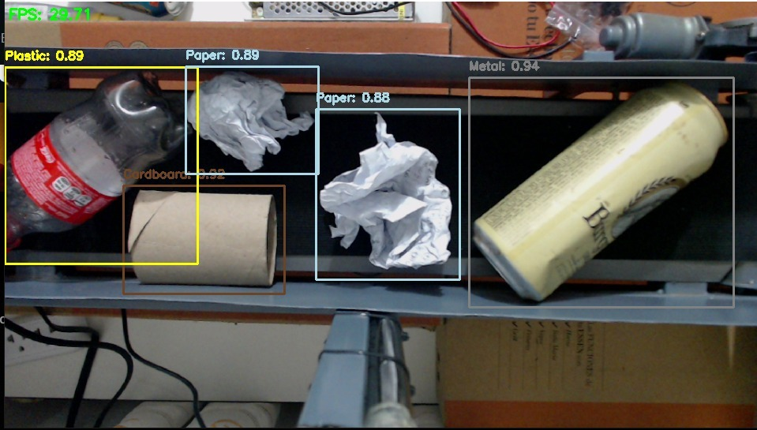
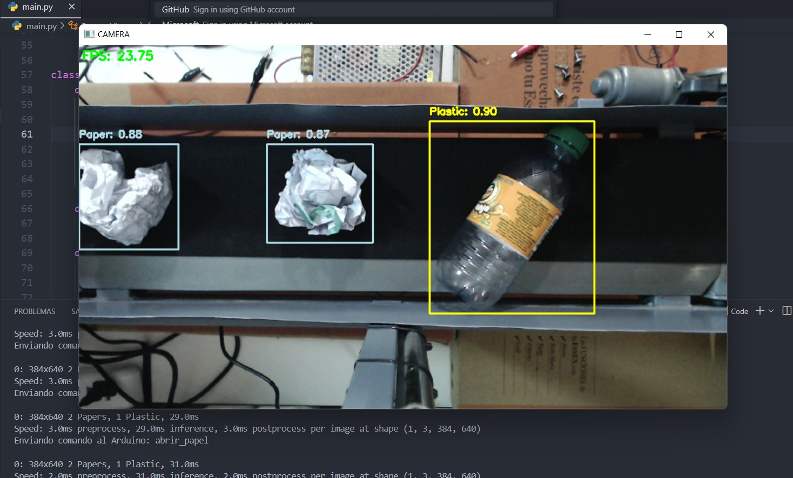
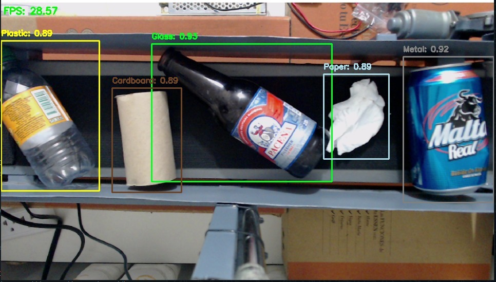
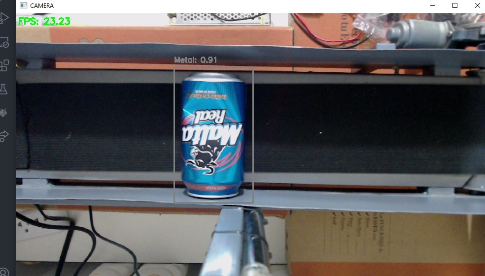

# GarbageDetection and Classifier with YOLO

This project implements a real-time trash detection and classification system using the YOLO (You Only Look Once) model. The system is designed to identify five categories of trash: plastic, paper, glass, metal, and cardboard. Once an object is detected and classified, the system controls a set of servomotors via an Arduino to open the corresponding chutes, ensuring that each type of trash is directed to its specific container.

## Features

- **Real-Time Detection**: Uses the YOLO model to detect and classify different types of trash with high accuracy and speed.
- **Visual Interface**: Live visualization of detections with bounding boxes and labels showing the category and confidence of detection.
- **Servo Control**: Serial communication with an Arduino to control servomotors that open chutes based on the detected type of trash.
- **Handling Multiple Detections**: Implementation of a priority queue to ensure that detected objects are processed in the correct order.

### Software

- **YOLO**: Object detection model trained to recognize different types of trash.
- **OpenCV**: Library for image processing and visualization of detections.
- **Python**: For integrating the detection model, image processing, and hardware control.
- **Arduino IDE**: For programming the servo control.

## Images of the inference

### Dataset
The images of the dataset can be found in the following link (Roboflow Universe)
https://universe.roboflow.com/j1nzo1/garbage-detection-project

### Image 1: Inference in Local

### Image 2: Inference in Local

### Image 3: Inference in Local

### Image 4: Inference in Local
